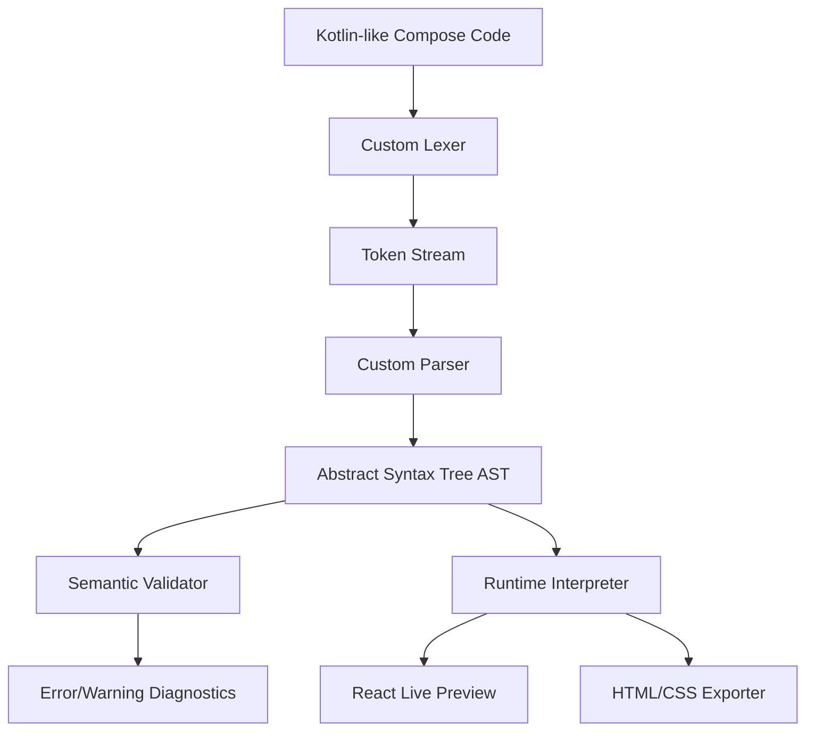

# ComposeWeb Studio

ComposeWeb Studio is an online, client-side Kotlin Compose interpreter that allows developers to write Jetpack Compose-like code and instantly preview a working website in the browser. 

---

## How It Can Help

ComposeWeb Studio bridges the gap between Kotlin's modern UI paradigm and the web, enabling a frictionless development and prototyping workflow.

* **Sub-Second Feedback Loop**: Skip the slow Gradle builds and emulator startup times. Write your Compose layouts and see them rendered instantly in the browser.
* **Easy Learning & Prototyping**: Perfect for learning Jetpack Compose's state-driven UI paradigm, experimenting with layout structures (`Column`, `Row`, `Box`), or mapping design mocks to code.
* **Ready-To-Go Exports**: Export your interactive Compose layouts directly into a `.zip` package containing both the clean Kotlin source and the setup web files, allowing you to easily port your UI to multiplatform projects.
* **Visual Inspection**: Use the built-in inspect mode to hover over preview elements and see their corresponding Compose AST node structure.

---

## Under the Hood (Architecture & Fine Details)

ComposeWeb Studio operates entirely in the browser using a custom-built lightweight compiler pipeline:



### The Compiler Pipeline
1. **Lexical Analysis**: Tokenizes Kotlin syntax, recognizing identifiers, operators, metric literals (`dp`, `sp`), property delegation operators (`by`), and state keywords (`remember`, `mutableStateOf`).
2. **AST Parsing**: A hand-written recursive-descent parser that generates a strongly-typed Abstract Syntax Tree (AST). It handles variable declarations, conditional `if/else` statements, loops, lambda expressions, and modifier chains.
3. **Semantic Validation**: Validates the AST against registered component rules, verifying argument counts, parameter types (e.g. asserting `dp` is passed to padding), and reporting diagnostics in real-time.
4. **State Interpreter**: Evaluates expressions in a sandbox state context. It simulates Compose's state tracking by resolving properties and handling state updates dynamically via Zustand.

### Extensible Registry System
To prevent code hardcoding and maintain a scalable architecture, we implement a decoupled registration pattern:
* **UI decoupling**: Individual components (`Column`, `Row`, `Text`, etc.) and modifiers are not hardcoded in the parser or renderer. 
* **Dynamic Registries**: Components are registered in the component registry and modifiers in the modifier registry.
* **The "Standard Library"**: All Material 3 styling maps, component properties, and layout structures are defined independently. Adding a new UI component or modifier requires zero edits to the core parsing or rendering engines.

---

## Key Syntax & Language Support

### 1. Variables & State Actions
* **State Declarations**: Support for `remember { mutableStateOf(initialValue) }` to track state.
  ```kotlin
  val count = remember { mutableStateOf(0) }
  ```
* **Property Delegation (`by` delegate)**: Standard property delegates to read/write states directly without calling `.value`.
  ```kotlin
  var text by remember { mutableStateOf("") }
  ```

### 2. Control Flow & Loops
* **Conditionals**: Support for if/else blocks to display views conditionally.
  ```kotlin
  if (showCard.value) {
      Text("Card is open")
  }
  ```
* **For Loops & Ranges (`..`)**: Iterates through collections and ranges recursively.
  ```kotlin
  for (i in 1..5) {
      Text(text = "Item number: ${i}")
  }
  ```

### 3. Metric Units
* Support for scales: `dp` (layout density) and `sp` (scalable pixels, e.g. for text font scaling) interchangeably.
  ```kotlin
  Text(text = "Header", fontSize = 24.sp, modifier = Modifier.padding(16.dp))
  ```

---

## Supported Composable Components

### 1. Core Layouts & Display
* `Column`: Places children sequentially in a vertical alignment.
* `Row`: Places children horizontally.
* `Box`: Stack container for overlapping elements.
* `Spacer`: Inserts spaces in row/column.
* `Text`: Displays text labels.
* `Image`: Displays loaded image from URL.
* `HorizontalDivider` / `VerticalDivider` / `Divider`: Structural lines.
* `LazyColumn` / `LazyRow`: Scrollable collections.

### 2. Material 3 Buttons
* `Button` (Filled)
* `ElevatedButton`
* `FilledTonalButton`
* `OutlinedButton`
* `TextButton`
* `IconButton`
* `FilledIconButton`
* `OutlinedIconButton`
* `FloatingActionButton`
* `ExtendedFloatingActionButton`

### 3. Cards & Surfaces
* `Card`
* `ElevatedCard`
* `OutlinedCard`
* `Surface`

### 4. Interactive Inputs & Widgets
* `TextField`
* `OutlinedTextField`
* `SecureTextField`
* `Checkbox`
* `RadioButton`
* `Switch`
* `Slider`
* `RangeSlider`
* `DatePicker` (renders an interactive calendar grid)
* `TimePicker` (renders an interactive digital clock)

### 5. Sheets, Dialogues & Menus
* `Scaffold` (supports slots: `topBar`, `bottomBar`, `floatingActionButton`)
* `NavigationBar` / `NavigationRail` / `NavigationDrawer` / `NavigationSuite`
* `TopAppBar` / `CenterAlignedTopAppBar` / `LargeTopAppBar` / `MediumTopAppBar` / `BottomAppBar`
* `AlertDialog` / `BasicAlertDialog`
* `ModalBottomSheet` / `BottomSheetScaffold`
* `Tooltip`
* `DropdownMenu` / `ExposedDropdownMenuBox`
* `Snackbar` / `SnackbarHost`
* `TabRow` / `ScrollableTabRow`
* `Pager`
* `Chip` / `AssistChip` / `FilterChip` / `InputChip` / `SuggestionChip`
* `Badge` / `BadgeBox`
* `ListItem`

---

## Supported Modifiers

All standard modifiers can be chained on any Composable:
* **Padding & Margins**: `padding(dp)`, `paddingFromBaseline(dp)`, `absolutePadding(dp)`.
* **Sizing & Bounds**: `size(dp)`, `width(dp)`, `height(dp)`, `fillMaxWidth(float)`, `fillMaxHeight(float)`, `fillMaxSize(float)`, `requiredSize(dp)`, `requiredWidth(dp)`, `requiredHeight(dp)`, `defaultMinSize(dp)`, `wrapContentWidth()`, `wrapContentHeight()`, `wrapContentSize()`.
* **Backgrounds & Borders**: `background(Color)`, `border(thickness, Color)`.
* **Transforms & Layers**: `graphicsLayer()`, `alpha(float)`, `rotate(degrees)`, `scale(multiplier)`.
* **Interactions**: `clickable { lambda }`, `combinedClickable()`, `toggleable()`, `selectable()`, `focusable()`, `focusRequester()`.
* **Scrolling**: `verticalScroll()`, `horizontalScroll()`.
* **Layout Weights**: `weight(float)`.
* **Alignments**: `align(Alignment)`, `alignBy()`.
* **Aspect Ratios**: `aspectRatio(float)`.
* **Animations**: `animateContentSize()`.
* **Safe Areas & Insets**: `imePadding()`, `systemBarsPadding()`, `navigationBarsPadding()`, `safeDrawingPadding()`, `windowInsetsPadding()`, `consumeWindowInsets()`.
* **No-ops**: `testTag()`, `semantics()`, `clearAndSetSemantics()`, `layoutId()`, `onGloballyPositioned()`.

---

## Supported Enums & Runtime Stubs

### Enums
* `Alignment`: `Top`, `Center`, `Bottom`, `Start`, `CenterHorizontally`, `End`, `TopStart`, `TopEnd`, `BottomStart`, `BottomEnd`.
* `Arrangement`: `Top`, `Center`, `Bottom`, `Start`, `End`, `SpaceBetween`, `SpaceAround`, `SpaceEvenly`.
* `FontWeight`: `Normal`, `Medium`, `SemiBold`, `Bold`, `ExtraBold`.
* `FontStyle`: `Normal`, `Italic`.
* `TextAlign`: `Left`, `Center`, `Right`, `Justify`.
* `TextDecoration`: `None`, `Underline`, `LineThrough`.
* `TextOverflow`: `Clip`, `Ellipsis`, `Visible`.
* `ContentScale`: `Crop`, `Fit`, `FillBounds`, `Inside`, `None`.
* `ContentAlpha`: `High`, `Medium`, `Disabled`.
* `KeyboardType`: `Text`, `Number`, `Phone`, `Email`, `Password`.
* `ImeAction`: `Default`, `Go`, `Search`, `Send`, `Next`, `Done`.
* `KeyboardCapitalization`: `None`, `Characters`, `Words`, `Sentences`.
* `StrokeCap`: `Butt`, `Round`, `Square`.
* `StrokeJoin`: `Miter`, `Round`, `Bevel`.
* `BlendMode`: `SrcOver`, `DstOver`.
* `Color`: `Red`, `Blue`, `Green`, `Yellow`, `White`, `Black`, `Gray`, `LightGray`, `DarkGray`, `Transparent`, `Primary`, `Secondary`.

### Side-Effect / Runtime Stubs
* `derivedStateOf { lambda }`
* `rememberSaveable { lambda }`
* `rememberCoroutineScope()`
* `LaunchedEffect(key) { lambda }`
* `DisposableEffect(key) { lambda }`
* `SideEffect { lambda }`
* `produceState(initialValue)`

---

## Live Demo

Try ComposeWeb Studio live at: [https://composestudio.netlify.app/](https://composestudio.netlify.app/)
